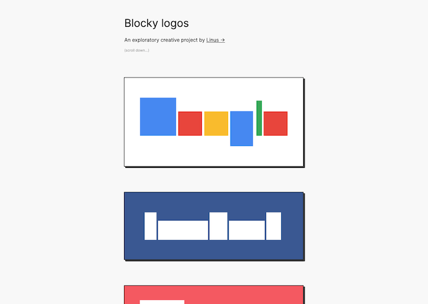

# Blocky logos 🖼

Just a small fun exploratory creative project, trying to distill down some common brand logos to rectangles.

Check out the live site on [thesephist.github.io/blocky-logos](https://thesephist.github.io/blocky-logos).

## Build and deploy

This project is about as simple as it gets. It's a static site with three files, two CSS stylesheets and a single `index.html`. They are all at the root of the repository. Fork and go nuts 🥜.